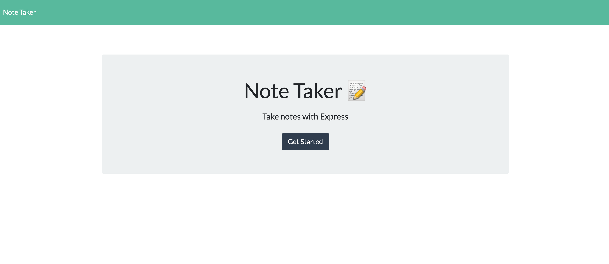
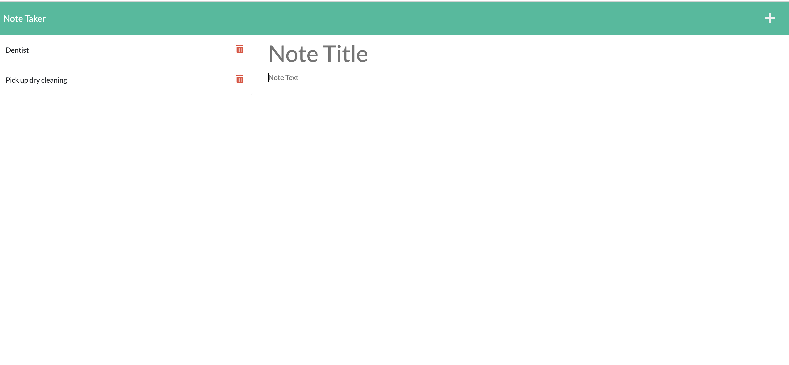

# <note-taking-applicatione>

## Description

- My motivation was to create an easy to use note-taking application which would be usefull for a busy person. 

- I buit this project becasue I wanted to create an application with will be easy to use, will not have a learning curve, and would focus only on creating, saving, and deleting notes. 
- In today's busy world it helps to keep track of important daily tasks; its simply and minimalistic UI doesn't take any time to learn this application, it is very simple to use, so a bust person will not have a a hard time adjusting to this new note taking application. 
- I leaned how back-end development works. How with a few routes I can create an interactive application. 

Github link: 
URL: 